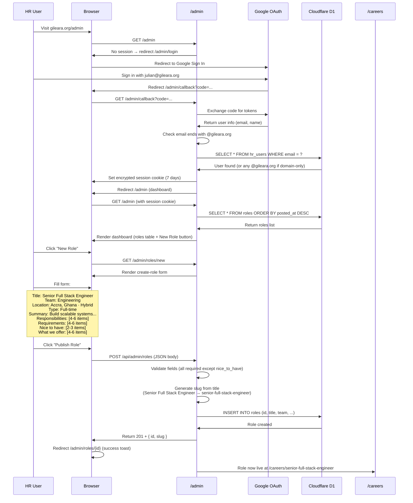
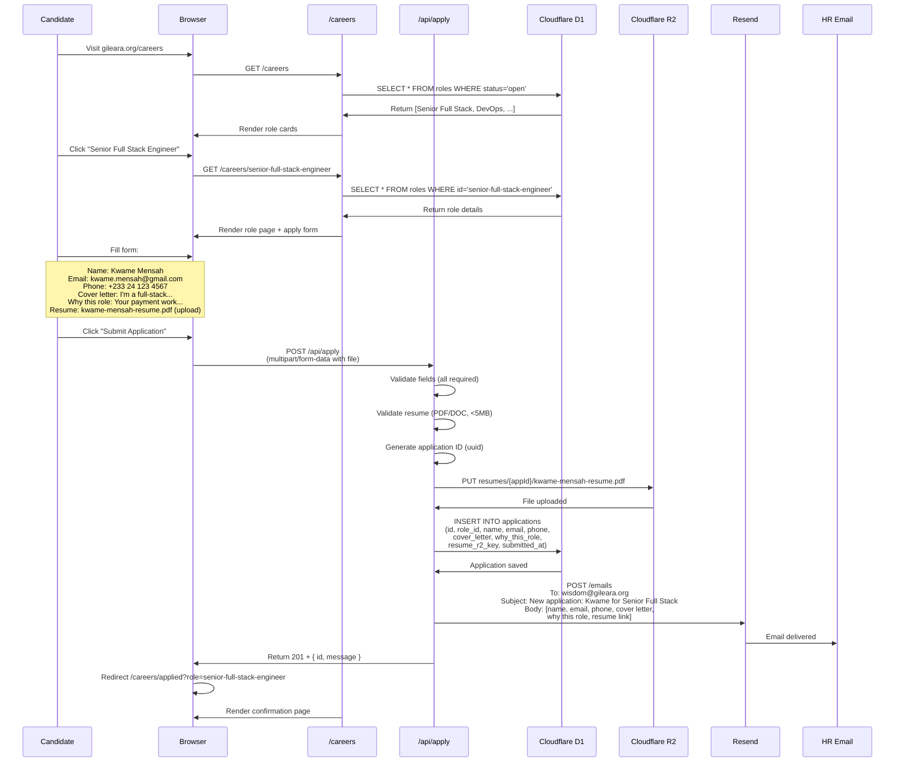
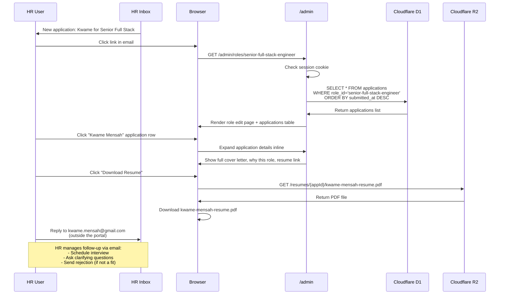

# Careers Portal — Detailed User Flows & Core Concept

**Last updated**: 2026-09-08  
**Status**: Design review

---

## Core Concept

A **two-sided careers platform**:
- **HR side (admin)**: Post roles, view applications, manage role status
- **Candidate side (public)**: Browse roles, apply with resume, get confirmation

**Key principle**: Keep it simple. HR manages follow-ups via email (their existing workflow), not in-app. The portal is a **posting + capture tool**, not a full ATS.

---

## User Flow 1: HR Posts a Role

### Entry point
HR user (Wisdom, Julian, or Daniel) wants to post a new role.

### Prerequisites
- HR user has a `@gileara.org` Google account
- HR user is in the `hr_users` whitelist table (or any `@gileara.org` if we choose domain-only auth)

### Step-by-step flow



### What HR sees

**1. Dashboard (`/admin`)**
```
┌─────────────────────────────────────────────────────────────┐
│  Gileara Careers Admin                    Hi, Julian  Logout│
├─────────────────────────────────────────────────────────────┤
│                                                               │
│  Roles                                          + New Role    │
│                                                               │
│  ┌───────────────────────────────────────────────────────┐  │
│  │ Title                 Team         Status    Apps   │  │
│  ├───────────────────────────────────────────────────────┤  │
│  │ Senior Full Stack...  Engineering  ● Open     3     │  │
│  │ UI/UX Designer        Design       ⏸ Paused   1     │  │
│  │ DevOps Engineer       Engineering  ● Open     7     │  │
│  └───────────────────────────────────────────────────────┘  │
│                                                               │
└─────────────────────────────────────────────────────────────┘
```

**2. Create Role Form (`/admin/roles/new`)**
```
┌─────────────────────────────────────────────────────────────┐
│  ← Back to Dashboard                                          │
├─────────────────────────────────────────────────────────────┤
│                                                               │
│  Create New Role                                              │
│                                                               │
│  Basic Information                                            │
│  ┌─────────────────────────────────────────────────────┐    │
│  │ Job Title *                                          │    │
│  │ [Senior Full Stack Engineer________________]        │    │
│  │                                                      │    │
│  │ Team *              Location *                       │    │
│  │ [Engineering ▼]     [Accra, Ghana · Hybrid_______]  │    │
│  │                                                      │    │
│  │ Employment Type *                                    │    │
│  │ [Full-time ▼]                                        │    │
│  │                                                      │    │
│  │ Summary * (1-2 sentences for role cards)            │    │
│  │ [Build scalable payment systems and customer-_____] │    │
│  │ [facing dashboards for MSME clients.______________] │    │
│  └─────────────────────────────────────────────────────┘    │
│                                                               │
│  What You'll Do                                               │
│  ┌─────────────────────────────────────────────────────┐    │
│  │ Responsibilities * (one per line)                    │    │
│  │ • [Build and maintain our payment integration____]  │    │
│  │ • [Design database schemas for new features______]  │    │
│  │ • [Review code and mentor junior engineers_______]  │    │
│  │ • [Work with product to scope technical projects_]  │    │
│  │   + Add another                                      │    │
│  └─────────────────────────────────────────────────────┘    │
│                                                               │
│  What We're Looking For                                       │
│  ┌─────────────────────────────────────────────────────┐    │
│  │ Requirements * (one per line)                        │    │
│  │ • [3+ years building production web applications_]   │    │
│  │ • [Strong TypeScript + React experience__________]   │    │
│  │ • [PostgreSQL or similar relational DB experience]   │    │
│  │ • [Experience with REST APIs and async patterns__]   │    │
│  │   + Add another                                      │    │
│  │                                                      │    │
│  │ Nice to Have (optional)                              │    │
│  │ • [Experience with Next.js or similar SSR________]   │    │
│  │ • [Cloudflare Workers or edge computing experience]  │    │
│  │   + Add another                                      │    │
│  └─────────────────────────────────────────────────────┘    │
│                                                               │
│  What We Offer                                                │
│  ┌─────────────────────────────────────────────────────┐    │
│  │ Benefits * (one per line)                            │    │
│  │ • [Competitive salary + equity stake_____________]   │    │
│  │ • [Hybrid work (3 days remote, 2 in Accra office)]  │    │
│  │ • [Health insurance for you + dependents________]    │    │
│  │ • [Professional development budget (courses, conf)]  │    │
│  │   + Add another                                      │    │
│  └─────────────────────────────────────────────────────┘    │
│                                                               │
│  [Cancel]                              [Save as Draft]        │
│                                        [Publish Role ✓]       │
│                                                               │
└─────────────────────────────────────────────────────────────┘
```

**3. After publishing**
```
✓ Role published at gileara.org/careers/senior-full-stack-engineer
```

---

## User Flow 2: Candidate Applies for a Role

### Entry point
A candidate (Kwame, a developer from Kumasi) hears about Gileara and visits the careers page.

### Prerequisites
- At least one role with `status='open'` exists in D1
- Candidate has a resume file (PDF or DOC, max 5MB)

### Step-by-step flow



### What the candidate sees

**1. Careers List (`/careers`)**
```
┌─────────────────────────────────────────────────────────────┐
│  [Gileara Logo]     About  Services  Insights  Contact      │
├─────────────────────────────────────────────────────────────┤
│                                                               │
│  Join Us                                                      │
│  We're a small team building the operations, sales, and       │
│  customer infrastructure MSME businesses can't build alone.   │
│  If that sounds like work worth doing, these roles are open:  │
│                                                               │
│  ┌─────────────────────────────────────────────────────┐    │
│  │ 01                                                   │    │
│  │ Senior Full Stack Engineer                           │    │
│  │ Engineering · Accra, Ghana · Hybrid · Full-time      │    │
│  │                                                      │    │
│  │ Build scalable payment systems and customer-facing   │    │
│  │ dashboards for MSME clients.                         │    │
│  │                                                      │    │
│  │                                      [View & Apply →]│    │
│  └─────────────────────────────────────────────────────┘    │
│                                                               │
│  ┌─────────────────────────────────────────────────────┐    │
│  │ 02                                                   │    │
│  │ DevOps Engineer                                      │    │
│  │ Engineering · Remote · Full-time                     │    │
│  │                                                      │    │
│  │ Own our deployment pipeline and ensure 99.9% uptime  │    │
│  │ for payment and ordering infrastructure.             │    │
│  │                                                      │    │
│  │                                      [View & Apply →]│    │
│  └─────────────────────────────────────────────────────┘    │
│                                                               │
└─────────────────────────────────────────────────────────────┘
```

**2. Role Detail + Apply Form (`/careers/senior-full-stack-engineer`)**
```
┌─────────────────────────────────────────────────────────────┐
│  [Gileara Logo]     About  Services  Insights  Contact      │
├─────────────────────────────────────────────────────────────┤
│                                                               │
│  ← Back to All Roles                                          │
│                                                               │
│  Senior Full Stack Engineer                                   │
│  Engineering · Accra, Ghana · Hybrid · Full-time              │
│                                                               │
│  ━━━━━━━━━━━━━━━━━━━━━━━━━━━━━━━━━━━━━━━━━━━━━━━━━━━━━━━  │
│                                                               │
│  What You'll Do                                               │
│  • Build and maintain our payment integration layer           │
│  • Design database schemas for new features                   │
│  • Review code and mentor junior engineers                    │
│  • Work with product to scope technical projects              │
│                                                               │
│  What We're Looking For                                       │
│  • 3+ years building production web applications              │
│  • Strong TypeScript + React experience                       │
│  • PostgreSQL or similar relational DB experience             │
│  • Experience with REST APIs and async patterns               │
│                                                               │
│  Nice to Have                                                 │
│  • Experience with Next.js or similar SSR frameworks          │
│  • Cloudflare Workers or edge computing experience            │
│                                                               │
│  What We Offer                                                │
│  • Competitive salary + equity stake                          │
│  • Hybrid work (3 days remote, 2 in Accra office)            │
│  • Health insurance for you + dependents                      │
│  • Professional development budget (courses, conferences)     │
│                                                               │
│  ━━━━━━━━━━━━━━━━━━━━━━━━━━━━━━━━━━━━━━━━━━━━━━━━━━━━━━━  │
│                                                               │
│  Apply for This Role                                          │
│                                                               │
│  ┌─────────────────────────────────────────────────────┐    │
│  │ Your Name *                                          │    │
│  │ [Kwame Mensah_________________________________]      │    │
│  │                                                      │    │
│  │ Email *                  Phone                       │    │
│  │ [kwame.mensah@____]     [+233 24 123 4567_______]   │    │
│  │                                                      │    │
│  │ Resume * (PDF or DOC, max 5MB)                       │    │
│  │ [📄 kwame-mensah-resume.pdf (1.2 MB)]  [Change]     │    │
│  │                                                      │    │
│  │ Cover Letter * (Tell us about your experience)       │    │
│  │ ┌────────────────────────────────────────────────┐  │    │
│  │ │I'm a full-stack developer with 4 years of      │  │    │
│  │ │experience building payment systems. Most       │  │    │
│  │ │recently I worked at...                         │  │    │
│  │ └────────────────────────────────────────────────┘  │    │
│  │                                                      │    │
│  │ Why This Role? * (What excites you about this?)     │    │
│  │ ┌────────────────────────────────────────────────┐  │    │
│  │ │Your work with mobile money integrations in     │  │    │
│  │ │Ghana is exactly what I want to build. I've     │  │    │
│  │ │seen firsthand how...                           │  │    │
│  │ └────────────────────────────────────────────────┘  │    │
│  │                                                      │    │
│  │ By submitting, you agree to our privacy policy.      │    │
│  │ We'll review your application and respond within     │    │
│  │ 5 business days.                                     │    │
│  │                                                      │    │
│  │                            [Submit Application ✓]    │    │
│  └─────────────────────────────────────────────────────┘    │
│                                                               │
└─────────────────────────────────────────────────────────────┘
```

**3. Confirmation Page (`/careers/applied?role=senior-full-stack-engineer`)**
```
┌─────────────────────────────────────────────────────────────┐
│  [Gileara Logo]     About  Services  Insights  Contact      │
├─────────────────────────────────────────────────────────────┤
│                                                               │
│                          ✓                                    │
│                                                               │
│             Application Submitted                             │
│                                                               │
│  Thanks, Kwame. We received your application for              │
│  Senior Full Stack Engineer.                                  │
│                                                               │
│  What happens next:                                           │
│  1. Our team will review your application within 5 business   │
│     days                                                      │
│  2. If your experience is a strong match, we'll reach out     │
│     to schedule an initial conversation                       │
│  3. We'll update you either way — no ghosting                 │
│                                                               │
│  We sent a confirmation to kwame.mensah@gmail.com.            │
│                                                               │
│                   [← Browse Other Roles]                      │
│                                                               │
└─────────────────────────────────────────────────────────────┘
```

---

## User Flow 3: HR Reviews Applications

### Entry point
HR receives an email notification that someone applied, or they check the admin dashboard.

### Step-by-step flow



### What HR sees

**Role Edit Page + Applications (`/admin/roles/senior-full-stack-engineer`)**
```
┌─────────────────────────────────────────────────────────────┐
│  ← Back to Dashboard                           Hi, Wisdom ▼  │
├─────────────────────────────────────────────────────────────┤
│                                                               │
│  Senior Full Stack Engineer                                   │
│  Engineering · Accra, Ghana · Hybrid · Full-time              │
│  ● Open     gileara.org/careers/senior-full-stack-engineer   │
│                                                               │
│  [Edit Role]  [Pause Role]  [Close Role]                     │
│                                                               │
│  ━━━━━━━━━━━━━━━━━━━━━━━━━━━━━━━━━━━━━━━━━━━━━━━━━━━━━━━  │
│                                                               │
│  Applications (3)                                             │
│                                                               │
│  ┌─────────────────────────────────────────────────────┐    │
│  │ Name              Email                  Submitted   │    │
│  ├─────────────────────────────────────────────────────┤    │
│  │ ▶ Kwame Mensah    kwame.mensah@...     2 days ago   │    │
│  │ ▶ Ama Osei        ama.osei@...         5 days ago   │    │
│  │ ▶ Kofi Asante     kofi.asante@...      1 week ago   │    │
│  └─────────────────────────────────────────────────────┘    │
│                                                               │
│  [Click a row to view details]                                │
│                                                               │
└─────────────────────────────────────────────────────────────┘

(HR clicks Kwame's row — it expands inline)

┌─────────────────────────────────────────────────────────────┐
│  │ ▼ Kwame Mensah    kwame.mensah@...     2 days ago   │    │
│  │                                                      │    │
│  │   Phone: +233 24 123 4567                            │    │
│  │                                                      │    │
│  │   Cover Letter:                                      │    │
│  │   I'm a full-stack developer with 4 years of         │    │
│  │   experience building payment systems. Most recently │    │
│  │   I worked at...                                     │    │
│  │                                                      │    │
│  │   Why This Role:                                     │    │
│  │   Your work with mobile money integrations in Ghana  │    │
│  │   is exactly what I want to build. I've seen...      │    │
│  │                                                      │    │
│  │   Resume: [Download kwame-mensah-resume.pdf]         │    │
│  │                                                      │    │
│  │   [Email kwame.mensah@gmail.com]  [Mark Reviewed]    │    │
│  └─────────────────────────────────────────────────────┘    │
└─────────────────────────────────────────────────────────────┘
```

---

## What's NOT in the flows (deliberately excluded)

❌ **Status tracking** — No "reviewing", "interviewed", "offered", "rejected" states. HR manages that in email or Notion.

❌ **In-app replies** — HR emails candidates directly (kwame.mensah@gmail.com). No messaging system in the portal.

❌ **Candidate notifications** — After the initial confirmation email, all updates come from HR's personal email, not the portal.

❌ **Interview scheduling in portal** — HR uses the existing `/api/schedule` booking system or sends calendar invites manually.

❌ **Resume parsing** — Files are stored as-is. HR downloads and reviews them manually.

❌ **Bulk actions** — No "reject all", no "export to CSV". HR reviews applications one by one.

❌ **Role templates** — Every role is created from scratch. No "duplicate last role" feature.

❌ **Application deadlines** — Roles stay open until HR manually pauses/closes them.

---

## Email HR Receives (when candidate applies)

**From**: Gileara Careers Portal <careers@gileara.org>  
**To**: wisdom@gileara.org  
**Subject**: New application: Kwame Mensah for Senior Full Stack Engineer  

**Body**:
```
You received a new application for Senior Full Stack Engineer.

━━━━━━━━━━━━━━━━━━━━━━━━━━━━━━━━━━━━━━━━━━━━━━━━━━━━━━━

Candidate: Kwame Mensah
Email: kwame.mensah@gmail.com
Phone: +233 24 123 4567

Cover Letter:
I'm a full-stack developer with 4 years of experience building
payment systems. Most recently I worked at...

Why This Role:
Your work with mobile money integrations in Ghana is exactly
what I want to build. I've seen firsthand how...

Resume: https://gileara.org/admin/resumes/abc123-uuid

━━━━━━━━━━━━━━━━━━━━━━━━━━━━━━━━━━━━━━━━━━━━━━━━━━━━━━━

View all applications for this role:
https://gileara.org/admin/roles/senior-full-stack-engineer

━━━━━━━━━━━━━━━━━━━━━━━━━━━━━━━━━━━━━━━━━━━━━━━━━━━━━━━

Sent from Gileara Careers Portal
```

---

## Questions for you after reviewing these flows

1. **Does the HR flow make sense?** Creating roles, receiving email notifications, reviewing applications in the admin — is this workflow realistic for how you'd actually use it?

2. **Is the candidate experience clear?** Browse roles → view detail → fill form → get confirmation — any steps missing?

3. **Email notifications — who should receive them?** Just Wisdom (HR lead), or all three leaders (Wisdom, Julian, Daniel)? Or configurable per role?

4. **Resume download link in email** — should it be a direct R2 link (works for 7 days, then expires), or always force HR to go through the admin portal for security?

5. **Role status transitions** — should there be a "Draft" status (HR can save incomplete roles before publishing), or always go straight to "Open"?

Let me know what needs to change in these flows before we proceed to the 5 design questions.
